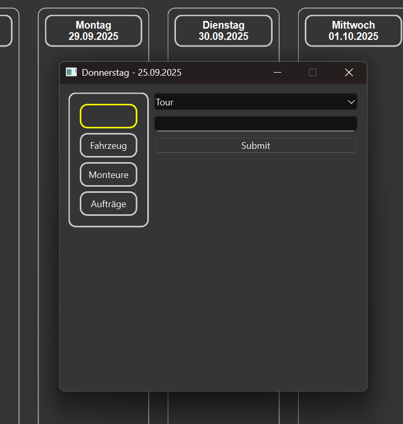

🗓️ TeamPlaner
---

A desktop planning application built with Python and PySide6 (Qt for Python).
It provides a weekly overview, supports multiple weeks, allows structured user input, and stores data persistently with SQLite.

✨ Features
---

📅 Weekly & multi-week overview – Navigate through weeks with arrow keys.

🎨 Dark mode support – Consistent, modern UI theme.

🧩 Custom widgets:

- ClickableLabel – labels that behave like buttons.

- ClickableFrame – frames that emit signals when clicked.

- CustomLineEdit – line edits with custom delete-key handling.

💾 Persistent storage – User inputs are stored in a local SQLite database.

⚙️ Configurable settings – Window title, week count, colors, and input types are all configurable via config.json.

🚨 Error handling – Custom error dialogs powered by ErrorWindow.

⌨️ Keyboard shortcuts – Navigate weeks and inputs efficiently.

⚙️ Customizing Settings
---

All configuration is stored in config.json (created automatically in %APPDATA%/TeamPlaner/config.json on first run).
You can adjust the application’s behavior and appearance by editing the following keys:

- weekday_list → Defines which weekdays are displayed.

  - Example: ["Montag", "Dienstag", "Mittwoch", "Donnerstag", "Freitag"]

  - You can add or remove days (e.g., include weekends if needed).

- weeks_shown → Controls how many weeks are visible in the Main Window.

  - Default: 2

- window_titel → Sets the title text of the application window.

- calc_true_color / calc_false_color → Hex color codes used to indicate calculation results.

  - calc_true_color: Border color when totals reach or exceed the target.

  - calc_false_color: Border color when totals are below the target.

- input_types → Define your custom input structures (see next section for details).

🎮 Usage Guide & Controls
---

🏠 Main Window

- ← Left Arrow → Navigate one week into the past

- → Right Arrow → Navigate one week into the future

- Mouse Click on a Day Label → Open the Input Window for that specific day

📝 Input Window

- Enter/Return → Add the current text to the focused input section

- ↑ / ↓ Arrow Keys → Change focus between input sections

- Delete Key → Remove the last entered input in the focused section

- Dropdown Menu → Change the input type (e.g., Tour, Termin, Lieferung)

✏️ Edit Window

- ↑ / ↓ Arrow Keys → Move focus between input sections

- Shift + ↑ / ↓ Arrow Keys → Toggle between display mode and edit mode

- Arrow Keys (in edit mode) → Select the section you want to edit

- Enter/Return → Edit the currently focused section’s text

- Shift + Enter/Return → Add a new input section below the current one

- Delete Key → Delete the entire focused input section

⚙️ Customizing Input Types

Input types are fully configurable via the config.json file.

- Add a new entry under the "input_types" dictionary.

- Each entry has:

  - Settings (first tuple):

    - ("Title", "Priority", "Inner Border Color", "Outer Border Color")

    - ⚠️ Priority is reserved for a future update.

  - Structure (following tuples): Each defines a section.

    - ("_", "type") → Hidden header (no label shown).

    - ("*Header", "type") → Fixed header (cannot be changed).

    - ("Header", "type") → Editable header.

- Input field types:

  - text → Regular text input (for notes / descriptions).

  - calc#>int< → Calculation field.

    - Each entry must follow the format: name\#amount.

    - The system sums all values.

    - If the total is ≥ int, the border turns success color (from config: calc_true_color).

    - If the total is < int, the border turns failure color (from config: calc_false_color).

- Important: Ensure that one existing input type key is given in "first_input_type" in config.json, so it appears as the default option.

ℹ️ About This Project
---

This application was originally developed for my current company to replace the old way of planning tasks on a physical whiteboard.
I worked on the program completely by myself, both during work hours and in my free time.

I have been allowed to share this as an open project.
Feedback, reviews, and suggestions for improvements are very welcome!

🖼️ Screenshots
---

Weekly Overview
Shows multiple weeks side by side with their planned tasks.


Input Window
Structured form for entering tasks, tours, or deliveries.



Edit Window
Modify or delete an existing entry. This example shows editing a **Tour** input:


🛠️ Tech Stack
---

Language: Python 3.10+

GUI Framework: PySide6 (Qt for Python)

Database: SQLite (via sqlite3)

Other: JSON-based configuration management

📦 Installation
---

Clone the repository:

```bash
git clone https://github.com/bra1nfo0d/TeamPlaner.git
cd teamplaner
```

Create a virtual environment (recommended):

```bash
python -m venv venv
source venv/bin/activate   # Linux / Mac
venv\Scripts\activate      # Windows
```

Install dependencies:

```bash
pip install -r requirements.txt
```

🚀 Usage
---

Run the application:

```bash
python -m team_planer.main
```

Run a test:

```bash
pytest -v
```

🚧 Roadmap / TODO
---

- Implement all date formats in DateManager.

- Improve error dialogs (better headers & visibility).

- Add unit tests for storage, input and config workflows.

- Add localization (multi-language support).

- Display the total of calc inputs

  - Show running totals in the InputWindow while entering values.

  - Update totals dynamically in the EditWindow when modifying entries.

🆕 Latest Update
---

v0.2 – Code cleanup & documentation

- Added detailed docstrings across core modules and widgets.

- Cleaned up code style and improved naming consistency.

- Improved maintainability by splitting logic into smaller setup methods.

- Updated project structure for clarity (core/, widgets/, windows/).

📂 Project Structure
---

<pre>team_planer/
│
├─ core/                # Config, storage, and date management
│   ├─ config_manager.py
│   ├─ storage_manager.py
│   └─ date_manager.py
│
├─ widgets/             # Custom reusable PySide6 widgets
│   ├─ clickable_frame.py
│   ├─ clickable_label.py
│   ├─ custom_line_edit.py
│   └─ ...
│
├─ windows/             # Application windows (UI screens)
│   ├─ main_window.py
│   ├─ input_window.py
│   ├─ edit_window.py
│   ├─ error_window.py
│   └─ ...
│
├─ main.py              # Application entry point
├─ requirements.txt     # List of dependencies
└─ README.md            # Documentation for GitHub and job applications</pre>

🤝 Contributing
---

Pull requests are welcome. For major changes, please open an issue first to discuss what you’d like to add or change.